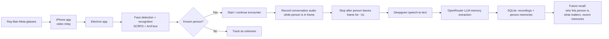

# Emory

Emory is a memory assistant for people living with dementia. The goal is simple: when someone familiar comes into view, Emory helps the wearer remember who they are, why they matter, and what they talked about before.

For the hackathon, we are building a local-first pipeline that connects **Ray-Ban Meta smart glasses**, an **iPhone companion app**, and an **Electron desktop app**. The desktop app identifies known faces, captures conversation context, turns that conversation into structured memories, and stores those memories so the user can get helpful reminders in future interactions.

**Documentation:** see [docs/README.md](./docs/README.md) for the detailed package and architecture docs.

## Why This Matters

People with dementia often recognize that a face is familiar but cannot place the person or recall recent context. Emory is designed to reduce that stress by turning live interactions into memory support:

- identify who is in front of the user
- capture conversation context while that person is present
- extract durable memories from the conversation
- surface a short summary the next time that person appears

## Hackathon Architecture



## End-to-End Product Flow

1. The Ray-Ban Meta glasses capture live video.
2. The iPhone app streams that video to the desktop app.
3. The Electron app runs face recognition against a database of people the user knows.
4. When a known person is detected, Emory starts an encounter and records conversation audio.
5. When that person leaves the frame for roughly 2 seconds, Emory closes the recording.
6. Deepgram converts the audio into a transcript.
7. An LLM through OpenRouter extracts useful memories and a short summary from the transcript.
8. Those memories are stored against the recognized person for future recall.
9. On a future encounter, Emory can tell the user who the person is and remind them of relevant context.

## What Exists In This Repo Today

The current repo already contains the core of the desktop recognition system:

- a local-first Electron desktop app with live camera processing
- ONNX-based face detection and face recognition (`SCRFD` + `ArcFace`)
- a SQLite-backed people database with embeddings, encounters, unknown sightings, analytics, and retention controls
- a working conversation-processing backend slice for:
  - storing `conversation_recordings` and `person_memories`
  - Deepgram transcription of saved audio files
  - OpenRouter-based structured memory extraction
  - querying memories by person name or time window from audio prompts

The mobile streaming bridge is represented in `apps/mobile`, but it is still early and should be described as **planned / in progress**, not complete.

## System Components

| Path | Role |
|------|------|
| `apps/desktop` | Main hackathon app today: Electron main/preload/renderer, recognition pipeline, local UI |
| `apps/mobile` | Planned iPhone relay app for video/audio streaming from the glasses |
| `packages/core` | Face pipeline, quality checks, liveness, appearance analysis, identity grading |
| `packages/db` | SQLite adapter, repositories, conversation storage, memories, encounters, retention |

## Current Technical Direction

- **Capture layer:** Ray-Ban Meta glasses -> iPhone app -> desktop app stream
- **Recognition layer:** local face recognition against a known-person embedding gallery
- **Conversation layer:** record audio while a recognized person is actively present
- **Transcription layer:** Deepgram speech-to-text
- **Memory layer:** OpenRouter LLM extracts structured memories from transcripts
- **Recall layer:** show or speak short summaries about the recognized person during future encounters, and answer simple spoken questions like "Who is Ryan?" or "What did I do at 2 PM today?"
- **Speech output layer:** synthesize short spoken answers through Cartesia and play them locally on desktop today, with the same response shape ready to move to the iPhone relay later

## Architecture Notes

- **Local-first by default:** identity data, embeddings, encounters, transcripts, and extracted memories are stored locally in SQLite.
- **Face recognition runs on desktop:** the Electron app is currently the main runtime for ONNX inference and persistence.
- **Memory extraction is asynchronous:** recording is stored first, then transcription and LLM extraction enrich it.
- **Memory querying now exists in a hackathon form:** audio query -> speech-to-text -> retrieval plan -> SQLite search -> grounded answer.
- **Future iPhone audio direction:** the iPhone app should act as the voice ingress and egress layer, forwarding short audio clips to the desktop query service and playing returned TTS audio back through the glasses.

## Hackathon Build Plan

1. Finish video relay from the iPhone app into the Electron app.
2. Wire recognized-person events to encounter lifecycle and audio recording.
3. Stop recordings when the person leaves frame for a configurable timeout.
4. Run transcription through Deepgram.
5. Extract memories and summaries through OpenRouter.
6. Attach the extracted memories to the recognized person in SQLite.
7. Add a recall surface that summarizes who the person is when they appear again.
8. Add simple querying so the user can ask for reminders about a person.

## Environment

Conversation processing currently expects these environment variables:

```bash
DEEPGRAM_API_KEY=...
OPENROUTER_API_KEY=...
MEMORY_EXTRACTION_MODEL=openai/gpt-4.1-mini
MEMORY_QUERY_MODEL=openai/gpt-4.1-mini
CARTESIA_API_KEY=...
CARTESIA_MODEL_ID=sonic-3
CARTESIA_VOICE_ID=6ccbfb76-1fc6-48f7-b71d-91ac6298247b
SAVE_TTS_DEBUG_AUDIO=0
```

In development, Cartesia responses are also saved under the Electron user-data `tts/` folder for debugging. You can force that on in other environments with `SAVE_TTS_DEBUG_AUDIO=1`.

The desktop face pipeline also expects the ONNX face models used by `@emory/core`.

For local manual pipeline testing, you can run:

```bash
cd apps/desktop
bun run manual:process-recording -- --audio-path /absolute/path/to/file.m4a
```

That script creates a temporary local SQLite DB, seeds placeholder people, runs transcription and memory extraction, and prints the stored recording and memories.

For manual memory-query testing, put your audio files under `tmp/manual-audio/` in the repo root and use:

```bash
mkdir -p tmp/manual-audio

cd apps/desktop
bun run manual:process-recording -- \
  --db-path ../../tmp/manual-test/emory.db \
  --audio-path ../../tmp/manual-audio/ryan-memory.m4a

bun run manual:query-memory -- \
  --db-path ../../tmp/manual-test/emory.db \
  --audio-path ../../tmp/manual-audio/who-is-ryan.m4a
```

The manual scripts seed Ryan as the wearer's grandson with these facts:
- Ryan goes to UVA
- Ryan is about to propose to his girlfriend

Current hackathon limitation:
- timeline questions work best when self-memories have already been stored in `person_memories`
- recordings are still keyed to the conversation partner, so self-timeline recall is currently memory-first rather than recording-first

## Development

```bash
bun install
bun run dev
```

Run the desktop app directly from [`apps/desktop`](./apps/desktop) with:

```bash
cd apps/desktop
bun run dev
```

Uses **Bun** as the package manager and **Turborepo** for task orchestration.

## Testing

```bash
bun run test
bun run test:core
bun run test:db
```
